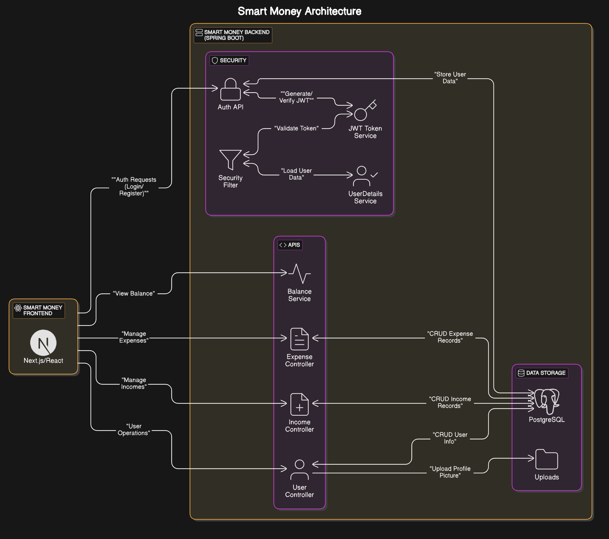

<p align="center">
  
</p>
<p align="center">
  
</p>

<h1 align="center" style="color: green;">🧠 Smart Money 🧠</h1>

**Smart Money** is your wallet's best friend — a platform designed to help you take control of your **finances**. Track your **expenses**, monitor your **earnings**, and plan for your **dream trip** or any long-term financial goal with ease.

---

## ✨ Features

- **Expense Tracking:** Log and categorize your daily spending.
- **Earnings Management:** Keep tabs on your income sources.
- **Financial Planning:** Set goals and plan for the future.
- **User-Friendly Interface:** Clean and intuitive design powered by Next.js and Tailwind CSS.
- **Secure Backend:** Built with Spring Boot and PostgreSQL for reliable data handling.

---

## 🏛️ MVC Architecture



🔗 [Click here to view the architecture diagram](https://app.eraser.io/workspace/R7MnCVXMmRYGHFdqH4Yt?origin=share)

The project follows the **Model-View-Controller (MVC)** pattern to ensure clean separation of concerns, scalability, and maintainability.

---

## 📁 Project Structure

### Backend

    
    com.smart_money
    ├── config
    ├── controller
    ├── dto
    │   ├── Request
    │   └── Response
    ├── model
    ├── repository
    ├── security
    └── service


### Frontend


    frontend
    ├── public
    ├── src
    │   ├── app
    │   ├── components
    │   ├── context
    │   ├── integrations
    │   ├── pages
    │   └── styles
    ├── middleware.ts
    └── tsconfig.json


## ⚙️ Tech Stack

### Back-End
- **Language:** Java 17 (Maven)
- **Framework:** Spring Boot 3.2.4
- **Database:** PostgreSQL 16
- **Security:** Spring Security
- **Web:** Spring Web

### Front-End
- **Languages:** JavaScript, TypeScript 5
- **Frameworks:**
    - React 19
    - Next.js 15.2.3
    - Tailwind CSS 3.4.17
- **Markup & Styling:** HTML, CSS

---

## 🚀 Getting Started

### Pre-requisites
- **Java 17** 
- **Node.js 20+** 
- **PostgreSQL 16**
- **Maven**

### Installation
1. **Clone the repository:**
   ```bash
   git clone https://github.com/NickeAlves/smart-money.git
   cd smart-money

2. **Set up the Back-End:**
Configure your PostgreSQL database in application.properties (under backend/src/main/resources).
Run the backend:
    ```bash
    cd backend
    mvn spring-boot:run

3. **Set up the Front-End:**
   Install dependencies and start the development server:
   ```bash
    cd frontend
    npm install
    npm run dev

4. Open your browser at http://localhost:3000 to see the app.

---


## 📜 License

All rights reserved © [Nicolas Alves](https://www.linkedin.com/in/nicolasdevback)

---

## 🤝 Contributing
Feel free to submit issues or pull requests if you'd like to contribute to Smart Money. Feedback is always welcome!

